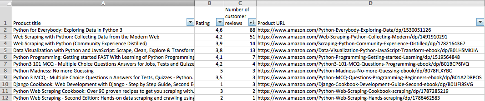

# amazon-scraper-python

[](https://travis-ci.org/tducret/amazon-scraper-python)
[](https://coveralls.io/github/tducret/amazon-scraper-python)
[](https://pypi.org/project/amazonscraper/)
[](https://hub.docker.com/r/thibdct/amazon2csv/)


# Description

This package allows you to search for products on [Amazon](https://www.amazon.com/) and extract some useful information (ratings, number of comments).


# Requirements

- Python 3
- pip3

# Installation

```bash
pip3 install -U amazonscraper
```

# Command line tool `amazon2csv.py`

After the package installation, you can use the `./amazon2csv.py` command in the terminal by going in project directory.

After passing a search request to the command (and an optional maximum number of products), it will return the results as csv :

```bash
./amazon2csv.py --keywords="Python programming" --maxproductnb=2
```

```csv
Product title,Rating,Number of customer reviews,Product URL
"Python Crash Course: A Hands-On, Project-Based Introduction to Programming",4.5,309,https://www.amazon.com/Python-Crash-Course-Hands-Project-Based/dp/1593276036
"A Smarter Way to Learn Python: Learn it faster. Remember it longer.",4.8,144,https://www.amazon.com/Smarter-Way-Learn-Python-Remember-ebook/dp/B077Z55G3B
```

You can also pass a search url (if you added complex filters for example), and save it to a file :

```bash
./amazon2csv.py --url="https://www.amazon.com/s/ref=nb_sb_noss_2?url=search-alias%3Daps&field-keywords=python+scraping" > output.csv
```

You can then open it with your favorite spreadsheet editor (and play with the filters) :



More info about the command in the help :

```bash
amazon2csv.py --help
```

## TODO

- [ ] If no product was found with the CSS selectors, it may be a new Amazon page style => change user agent and get the new page. Loop on all the user agents and check all the CSS selectors again
- [ ] Find a way to get the products without css selectors

##CREDITS

-Myself -lol